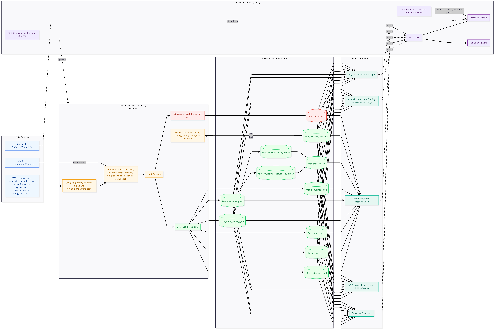
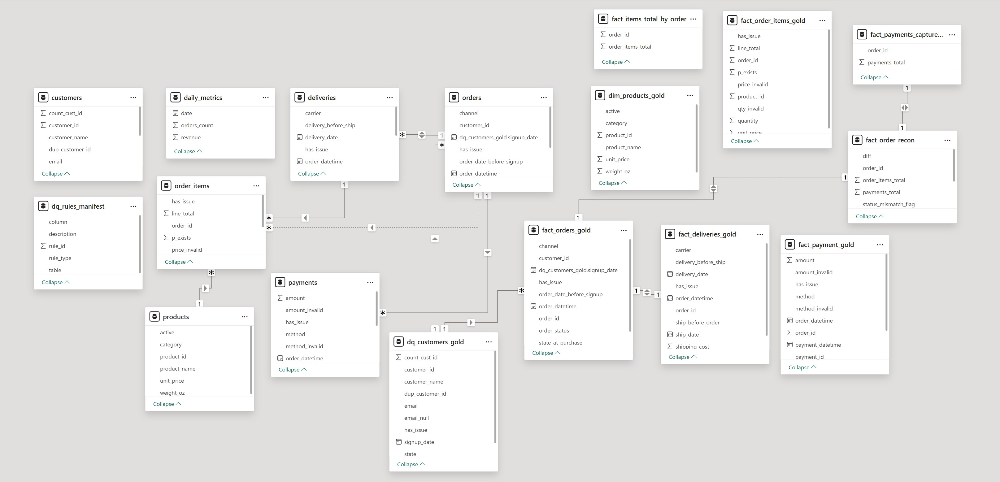
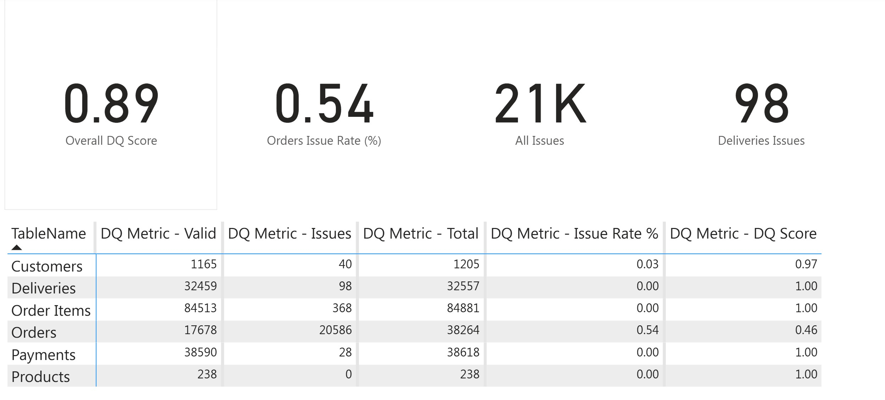

# Data Quality Management & Anomaly Detection System
## Power BI | Power Query | DAX

A production-ready Data Quality Management (DQM) system built in Power BI with comprehensive ETL data validation, reconciliation logic, and statistical anomaly detection.



---

## 🎯 Key Features

- **Automated Data Quality Checks** – Validates completeness, validity, uniqueness, and referential integrity
- **DQ Scorecard** – Per-table metrics with drill-through to flagged records
- **Order-Payment Reconciliation** – Identifies mismatches between order totals and captured payments
- **Anomaly Detection** – Statistical outlier detection using rolling 14-day sigma rules plus Power BI's built-in anomaly finder
- **Production-Ready** – Configured for scheduled refresh, optional Dataflows/Fabric integration, and Row-Level Security

---

## 📁 Repository Structure

```
├── data/                    # Sample CSV files (synthetic data with intentional issues)
├── pbix/                    # Power BI report file (.pbix) and template (.pbit)
├── dax/                     # DAX measures organized by feature area
├── docs/                    # Screenshots and architecture diagrams
└── README.md
```

---

## 🚀 Quick Start

### Prerequisites
- Power BI Desktop (latest version)
- Basic understanding of Power Query and DAX

### Getting Started

1. **Clone the repository**
   ```bash
   git clone https://github.com/yourusername/dqm-anomaly-detection.git
   cd dqm-anomaly-detection
   ```

2. **Open the report**
   - Option A: Open `./pbix/DQM_Anomaly.pbix` directly
   - Option B: Use the template `./pbix/DQM_Anomaly.pbit` and point to your `./data/` folder when prompted

3. **Review the ETL logic**
   - Go to **Transform Data** in Power BI Desktop
   - Explore the staging queries and data quality flag logic

4. **Explore the dashboards**
   - **Executive Summary** – High-level KPIs and overall DQ score
   - **DQ Scorecard** – Detailed metrics per table with drill-through
   - **Reconciliation** – Order vs payment mismatches
   - **Anomaly Detection** – Statistical outliers with visualizations
   - **Day Details** – Drill-through page for granular analysis

---

## 📊 Data Model

### Gold Tables (Cleaned)
- `dim_customers_gold` – Validated customer records
- `dim_products_gold` – Product catalog with schema drift handling
- `fact_orders_gold` – Orders passing all validation rules
- `fact_order_items_gold` – Line items with valid quantities and prices
- `fact_payments_gold` – Payment transactions with capture status
- `fact_deliveries_gold` – Shipping and delivery records
- `fact_order_recon` – Reconciliation between items and payments
- `daily_metrics_enriched` – Aggregated metrics with anomaly flags

### Issue Tables (Audit Trail)
- `dq_customers_issues`
- `dq_products_issues`
- `dq_orders_issues`
- `dq_order_items_issues`
- `dq_payments_issues`
- `dq_deliveries_issues`

---

## ✅ Data Quality Rules

### Completeness
- Required fields must not be null (email, shipping_cost, etc.)

### Domain Validation
- State codes must be in approved list: CA, NY, TX, FL, IL, WA, MA, GA, NC, PA, IN
- Enum fields validated against allowed values

### Uniqueness
- No duplicate `customer_id` or `product_id`

### Referential Integrity
- All `product_id` in order items must exist in products table
- All `customer_id` in orders must exist in customers table

### Temporal Logic
- `order_datetime` ≥ `signup_date`
- `delivery_date` ≥ `ship_date` ≥ `order_date`

### Range Validation
- `quantity` ≥ 1
- `unit_price` > 0
- `amount` ≥ 0

---

## 🔧 ETL Process

Each source table follows this pattern:

1. **Staging Query** – Applies validation rules and adds flag columns
2. **Issue Reference** – Filters `has_issue = 1` for audit
3. **Gold Reference** – Filters `has_issue = 0` and removes helper columns

### Example Flags (Order Items)

```m
// Quantity validation
qty_invalid = if [quantity] = null or [quantity] < 1 then 1 else 0

// Price validation  
price_invalid = if [unit_price] = null or [unit_price] <= 0 then 1 else 0

// Foreign key validation
fk_product_orphan = if Table.IsEmpty([prod]) then 1 else 0

// Composite flag
has_issue = if qty_invalid = 1 or price_invalid = 1 or fk_product_orphan = 1 then 1 else 0
```

---

## 📈 Key DAX Measures

### DQ Score Pattern
```dax
Customers Valid = COUNTROWS('dim_customers_gold')
Customers Issues = COUNTROWS('dq_customers_issues')
Customers Total = [Customers Valid] + [Customers Issues]
Customers Issue Rate (%) = DIVIDE([Customers Issues], [Customers Total], 0)
Customers DQ Score = 1 - [Customers Issue Rate (%)]
```

### Reconciliation
```dax
Orders with Mismatch = 
CALCULATE(
    DISTINCTCOUNT('fact_order_recon'[order_id]),
    'fact_order_recon'[status_mismatch_flag] = 1
)
```

### Anomaly Detection
```dax
Anomaly Count (Orders) = SUM('daily_metrics_enriched'[orders_anomaly_flag])

Anomaly Rate (Orders) - Last 30d = 
VAR maxDate = MAX('daily_metrics_enriched'[date])
VAR days = CALCULATE(
    DISTINCTCOUNT('daily_metrics_enriched'[date]), 
    'daily_metrics_enriched'[date] > maxDate - 30
)
RETURN DIVIDE([Anomaly Count (Orders) - Last 30d], days, 0)
```

Full DAX library available in `/dax/`.

---

## 🌐 Deployment

### Power BI Service
1. Publish the report to your workspace
2. Configure data source credentials
3. Set up scheduled refresh (daily/hourly recommended)

### Data Source Options
- **Cloud**: Store CSVs on OneDrive/SharePoint for automatic refresh
- **On-Premises**: Configure On-premises Data Gateway for local files

### Optional Enhancements
- **Dataflows/Fabric**: Migrate Power Query logic to Dataflows Gen2 for centralized ETL (see `/deployment/dataflows-notes.md`)
- **Row-Level Security**: Implement filters by state or channel (see `/deployment/rls-policy.md`)

---

## 📸 Screenshots

### Data Models


### DQ Scorecard


### Anomaly Detection


---

## 🗺️ Roadmap

- [ ] Implement data alerts for DQ Score < 95%
- [ ] Add monthly trend analysis for DQ issues
- [ ] Integrate Prophet/ARIMA for advanced forecasting (Fabric)
- [ ] Create unit tests for Power Query M scripts
- [ ] Add CI/CD pipeline for automated deployment

---

## 📝 Testing

The `/tests/` folder contains:
- **dq-rules-checklist.md** – Complete validation rule documentation
- **validation-queries.md** – Sample queries to verify data quality

Run these checks after modifying ETL logic to ensure integrity.

---

## 🔒 License

MIT License - see [LICENSE](LICENSE) file for details

---


## ⚠️ Data Notice

This project uses synthetic data with intentional quality issues for demonstration purposes. Replace files in `/data/` with your actual data sources. The ETL and DQ logic is designed to handle real-world scenarios.

---

**Built with** ⚡ Power BI | 🔄 Power Query | 📊 DAX
